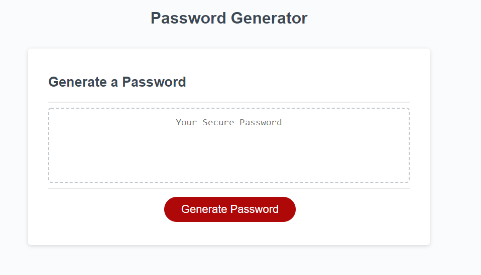

# Password-Generator

## Description

This project help users create unique passwords that are generated by this code. All you have to do is click the button and answer the questions to make the password that fits your liking.

## Table of Contents

- [Installation](#installation)
- [Usage](#usage)
- [License](#license)

## Installation

Steps to follow to install password generator project:
1. Go to Gitbash and select a folder to store the project
2. Use the git clone command to clone the repo
3. Use Visual Studio to open the folder and access the project
4. Final step, enjoy the project

## Usage

[ScreenShot1](images/PG.png)

## License

For this project, I did not use a license.
